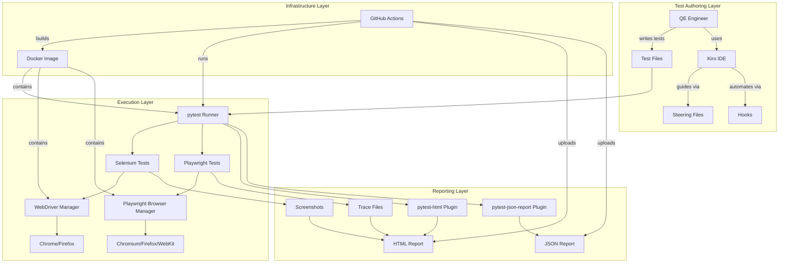

# Design Document: Test Automation Framework

## Overview

The Test Automation Framework is a unified Python-based testing solution that enables QE teams to author, execute, and report on automated browser tests using both Selenium WebDriver and Playwright. The framework provides a consistent pytest-based execution model, automated HTML and JSON report generation, Docker containerization for reproducible test environments, and deep integration with Kiro IDE through steering files and hooks.

### Key Design Goals

1. **Unified Execution Model**: Single pytest-based runner for both Selenium and Playwright tests
2. **Developer Experience**: Kiro IDE integration via steering files and hooks to accelerate test authoring
3. **Reproducibility**: Docker-based execution ensuring consistent test environments across local and CI
4. **Observability**: Automated HTML and JSON report generation with screenshots and trace files
5. **Team Collaboration**: GitHub-first workflow with CI/CD integration and clear contribution guidelines

### Technology Stack

- **Test Framework**: pytest (unified test runner)
- **Browser Automation**: Selenium WebDriver, Playwright (Python)
- **Reporting**: pytest-html, pytest-json-report
- **Parallelization**: pytest-xdist
- **Containerization**: Docker, Docker Compose
- **CI/CD**: GitHub Actions
- **Configuration**: YAML (config.yaml) and environment variables

---

## Architecture

### High-Level Architecture



### Component Interaction Flow

1. **Test Authoring**: QE engineer writes test in `tests/` directory, Kiro hooks scaffold file structure
2. **Configuration Loading**: pytest reads `config.yaml` for browser, headless mode, base URL, timeouts
3. **Test Discovery**: pytest discovers tests based on naming convention (`test_*.py`)
4. **Fixture Initialization**: pytest fixtures initialize WebDriver or Playwright browser contexts
5. **Test Execution**: Tests run sequentially or in parallel (pytest-xdist)
6. **Failure Handling**: On failure, capture screenshot (Selenium/Playwright) and trace (Playwright)
7. **Report Generation**: pytest plugins generate HTML and JSON reports with embedded artifacts
8. **Cleanup**: Fixtures tear down browser sessions, reports saved to `reports/` directory

---

## Components and Interfaces

### 1. Project Structure Component

**Responsibility**: Define and maintain the repository layout for clarity and maintainability.

**Directory Structure**:
```
test-automation-framework/
├── .github/
│   └── workflows/
│       └── test.yml                 # GitHub Actions CI pipeline
├── .kiro/
│   ├── hooks/
│   │   ├── test-file-review.json    # Hook: review test file on save
│   │   ├── report-summary.json      # Hook: summarize report after run
│   │   └── scaffold-test.json       # Hook: scaffold new test file
│   └── steering/
│       ├── test-writing-guide.md    # Guide for writing tests
│       ├── framework-overview.md    # Framework structure and usage
│       └── docker-execution.md      # Docker build and run guide
├── tests/
│   ├── selenium/
│   │   ├── __init__.py
│   │   ├── conftest.py              # Selenium fixtures
│   │   └── test_example_selenium.py # Example Selenium test
│   ├── playwright/
│   │   ├── __init__.py
│   │   ├── conftest.py              # Playwright fixtures
│   │   └── test_example_playwright.py # Example Playwright test
│   └── conftest.py                  # Shared pytest fixtures
├── framework/
│   ├── __init__.py
│   ├── config.py                    # Configuration loader
│   ├── selenium_driver.py           # Selenium WebDriver wrapper
│   ├── playwright_driver.py         # Playwright browser wrapper
│   └── report_utils.py              # Report generation utilities
├── reports/                         # Generated test reports (gitignored)
├── docker/
│   ├── Dockerfile                   # Docker image definition
│   └── docker-compose.yml           # Docker Compose service
├── config.yaml                      # Central configuration file
├── requirements.txt                 # Python dependencies
├── pytest.ini                       # pytest configuration
├── .gitignore                       # Git ignore rules
├── README.md                        # Setup and usage documentation
├── CONTRIBUTING.md                  # Contribution guidelines
├── CHANGELOG.md                     # Version history
└── .github/
    └── ISSUE_TEMPLATE/
        └── pilot-feedback.md        # Pilot feedback template
```

**Key Files**:
- `config.yaml`: Central configuration for browser selection, base URL, timeouts, headless mode
- `pytest.ini`: pytest configuration including report output paths, markers, and plugins
- `requirements.txt`: Pinned Python dependencies (selenium, playwright, pytest, pytest-html, pytest-json-report, pytest-xdist, pyyaml)

---

### 2. Configuration Component

**Responsibility**: Load and provide configuration values to test execution components.

**Interface**:
```python
# framework/config.py

from typing import Optional
import yaml
import os

class Config:
    """Central configuration loader with fallback defaults."""
    
    def __init__(self, config_path: str = "config.yaml"):
        self.config_path = config_path
        self._config = self._load_config()
    
    def _load_config(self) -> dict:
        """Load configuration from YAML file."""
        if os.path.exists(self.config_path):
            with open(self.config_path, 'r') as f:
                return yaml.safe_load(f) or {}
        return {}
    
    def get(self, key: str, default: Optional[any] = None) -> any:
        """Get configuration value with fallback to default."""
        return self._config.get(key, default)
    
    @property
    def base_url(self) -> str:
        return self.get('base_url', 'http://localhost:8080')
    
    @property
    def browser(self) -> str:
        return self.get('browser', 'chrome')
    
    @property
    def headless(self) -> bool:
        return self.get('headless', False)
    
    @property
    def timeout(self) -> int:
        return self.get('timeout', 30)
    
    @property
    def parallel_workers(self) -> int:
        return self.get('parallel_workers', 1)
    
    @property
    def report_dir(self) -> str:
        return self.get('report_dir', 'reports')
```

**Configuration Schema** (`config.yaml`):
```yaml
# Base URL for application under test
base_url: "https://example.com"

# Browser selection: chrome, firefox (Selenium); chromium, firefox, webkit (Playwright)
browser: "chrome"

# Headless mode: true for CI, false for local debugging
headless: true

# Default timeout for element waits (seconds)
timeout: 30

# Number of parallel workers for pytest-xdist (1 = sequential)
parallel_workers: 4

# Report output directory
report_dir: "reports"

# Selenium-specific settings
selenium:
  implicit_wait: 10
  page_load_timeout: 60

# Playwright-specific settings
playwright:
  slow_mo: 0  # Slow down operations by N milliseconds
  tracing: true  # Enable tracing on failure
```

---

### 3. Selenium Driver Component

**Responsibility**: Initialize, configure, and manage Selenium WebDriver instances.

**Interface**:
```python
# framework/selenium_driver.py

from selenium import webdriver
from selenium.webdriver.chrome.service import Service as ChromeService
from selenium.webdriver.firefox.service import Service as FirefoxService
from webdriver_manager.chrome import ChromeDriverManager
from webdriver_manager.firefox import GeckoDriverManager
from typing import Optional
import os

class SeleniumDriver:
    """Selenium WebDriver wrapper with automatic driver management."""
    
    def __init__(self, browser: str = "chrome", headless: bool = False):
        self.browser = browser.lower()
        self.headless = headless
        self.driver: Optional[webdriver.Remote] = None
    
    def initialize(self) -> webdriver.Remote:
        """Initialize WebDriver based on browser configuration."""
        try:
            if self.browser == "chrome":
                options = webdriver.ChromeOptions()
                if self.headless:
                    options.add_argument("--headless")
                options.add_argument("--no-sandbox")
                options.add_argument("--disable-dev-shm-usage")
                service = ChromeService(ChromeDriverManager().install())
                self.driver = webdriver.Chrome(service=service, options=options)
            
            elif self.browser == "firefox":
                options = webdriver.FirefoxOptions()
                if self.headless:
                    options.add_argument("--headless")
                service = FirefoxService(GeckoDriverManager().install())
                self.driver = webdriver.Firefox(service=service, options=options)
            
            else:
                raise ValueError(f"Unsupported browser: {self.browser}. Supported: chrome, firefox")
            
            return self.driver
        
        except Exception as e:
            raise RuntimeError(
                f"Failed to initialize {self.browser} WebDriver. "
                f"Check browser and driver version compatibility. Error: {str(e)}"
            )
    
    def quit(self):
        """Tear down WebDriver session."""
        if self.driver:
            self.driver.quit()
            self.driver = None
    
    def capture_screenshot(self, filepath: str) -> bool:
        """Capture screenshot to specified filepath."""
        if self.driver:
            try:
                os.makedirs(os.path.dirname(filepath), exist_ok=True)
                self.driver.save_screenshot(filepath)
                return True
            except Exception as e:
                print(f"Failed to capture screenshot: {e}")
                return False
        return False
```

**Pytest Fixture** (`tests/selenium/conftest.py`):
```python
import pytest
from framework.config import Config
from framework.selenium_driver import SeleniumDriver

@pytest.fixture(scope="function")
def selenium_driver(request):
    """Pytest fixture providing Selenium WebDriver instance."""
    config = Config()
    driver_wrapper = SeleniumDriver(
        browser=config.browser,
        headless=config.headless
    )
    driver = driver_wrapper.initialize()
    driver.implicitly_wait(config.get('selenium', {}).get('implicit_wait', 10))
    driver.set_page_load_timeout(config.get('selenium', {}).get('page_load_timeout', 60))
    
    yield driver
    
    # Capture screenshot on failure
    if request.node.rep_call.failed:
        screenshot_path = f"{config.report_dir}/screenshots/{request.node.name}.png"
        driver_wrapper.capture_screenshot(screenshot_path)
        # Attach to pytest-html report
        extra = getattr(request.node, 'extra', [])
        extra.append(pytest.html.extra.image(screenshot_path))
        request.node.extra = extra
    
    driver_wrapper.quit()

@pytest.hookimpl(tryfirst=True, hookwrapper=True)
def pytest_runtest_makereport(item, call):
    """Hook to capture test result for screenshot on failure."""
    outcome = yield
    rep = outcome.get_result()
    setattr(item, f"rep_{rep.when}", rep)
```

---

### 4. Playwright Driver Component

**Responsibility**: Initialize, configure, and manage Playwright browser contexts.

**Interface**:
```python
# framework/playwright_driver.py

from playwright.sync_api import Browser, BrowserContext, Page, sync_playwright
from typing import Optional, Literal
import os

BrowserType = Literal["chromium", "firefox", "webkit"]

class PlaywrightDriver:
    """Playwright browser wrapper with tracing support."""
    
    def __init__(
        self,
        browser_type: BrowserType = "chromium",
        headless: bool = False,
        slow_mo: int = 0,
        tracing: bool = False
    ):
        self.browser_type = browser_type
        self.headless = headless
        self.slow_mo = slow_mo
        self.tracing = tracing
        self.playwright = None
        self.browser: Optional[Browser] = None
        self.context: Optional[BrowserContext] = None
    
    def initialize(self) -> BrowserContext:
        """Initialize Playwright browser and context."""
        try:
            self.playwright = sync_playwright().start()
            
            if self.browser_type == "chromium":
                self.browser = self.playwright.chromium.launch(
                    headless=self.headless,
                    slow_mo=self.slow_mo
                )
            elif self.browser_type == "firefox":
                self.browser = self.playwright.firefox.launch(
                    headless=self.headless,
                    slow_mo=self.slow_mo
                )
            elif self.browser_type == "webkit":
                self.browser = self.playwright.webkit.launch(
                    headless=self.headless,
                    slow_mo=self.slow_mo
                )
            else:
                raise ValueError(
                    f"Unsupported browser: {self.browser_type}. "
                    f"Supported: chromium, firefox, webkit"
                )
            
            self.context = self.browser.new_context()
            
            if self.tracing:
                self.context.tracing.start(screenshots=True, snapshots=True)
            
            return self.context
        
        except Exception as e:
            raise RuntimeError(
                f"Failed to initialize Playwright {self.browser_type} browser. "
                f"Error: {str(e)}"
            )
    
    def quit(self, trace_path: Optional[str] = None):
        """Tear down Playwright browser and context."""
        if self.context:
            if self.tracing and trace_path:
                try:
                    os.makedirs(os.path.dirname(trace_path), exist_ok=True)
                    self.context.tracing.stop(path=trace_path)
                except Exception as e:
                    print(f"Failed to save trace: {e}")
            self.context.close()
            self.context = None
        
        if self.browser:
            self.browser.close()
            self.browser = None
        
        if self.playwright:
            self.playwright.stop()
            self.playwright = None
    
    def capture_screenshot(self, page: Page, filepath: str) -> bool:
        """Capture screenshot from page to specified filepath."""
        try:
            os.makedirs(os.path.dirname(filepath), exist_ok=True)
            page.screenshot(path=filepath, full_page=True)
            return True
        except Exception as e:
            print(f"Failed to capture screenshot: {e}")
            return False
```

**Pytest Fixture** (`tests/playwright/conftest.py`):
```python
import pytest
from framework.config import Config
from framework.playwright_driver import PlaywrightDriver

@pytest.fixture(scope="function")
def playwright_context(request):
    """Pytest fixture providing Playwright browser context."""
    config = Config()
    playwright_config = config.get('playwright', {})
    
    driver_wrapper = PlaywrightDriver(
        browser_type=config.browser if config.browser in ["chromium", "firefox", "webkit"] else "chromium",
        headless=config.headless,
        slow_mo=playwright_config.get('slow_mo', 0),
        tracing=playwright_config.get('tracing', True)
    )
    context = driver_wrapper.initialize()
    
    yield context
    
    # Capture screenshot and trace on failure
    if request.node.rep_call.failed:
        page = context.pages[0] if context.pages else None
        if page:
            screenshot_path = f"{config.report_dir}/screenshots/{request.node.name}.png"
            driver_wrapper.capture_screenshot(page, screenshot_path)
            # Attach to pytest-html report
            extra = getattr(request.node, 'extra', [])
            extra.append(pytest.html.extra.image(screenshot_path))
            request.node.extra = extra
        
        trace_path = f"{config.report_dir}/traces/{request.node.name}.zip"
        driver_wrapper.quit(trace_path=trace_path)
    else:
        driver_wrapper.quit()

@pytest.fixture(scope="function")
def playwright_page(playwright_context):
    """Pytest fixture providing Playwright page."""
    page = playwright_context.new_page()
    yield page
    page.close()

@pytest.hookimpl(tryfirst=True, hookwrapper=True)
def pytest_runtest_makereport(item, call):
    """Hook to capture test result for screenshot/trace on failure."""
    outcome = yield
    rep = outcome.get_result()
    setattr(item, f"rep_{rep.when}", rep)
```

---

### 5. Test Runner Component

**Responsibility**: Discover, execute, and coordinate test execution using pytest.

**Configuration** (`pytest.ini`):
```ini
[pytest]
# Test discovery patterns
python_files = test_*.py
python_classes = Test*
python_functions = test_*

# Markers for filtering tests
markers =
    selenium: Selenium WebDriver tests
    playwright: Playwright tests
    smoke: Smoke tests for quick validation
    regression: Full regression suite

# Report output paths
addopts =
    --html=reports/report.html
    --self-contained-html
    --json-report
    --json-report-file=reports/report.json
    --json-report-indent=2
    -v
    --tb=short

# Parallel execution (overridden by -n flag)
# addopts = -n auto

# Timeout for tests (requires pytest-timeout)
timeout = 300

# Capture output
log_cli = true
log_cli_level = INFO
```

**Execution Commands**:
```bash
# Run all tests
pytest

# Run only Selenium tests
pytest -m selenium

# Run only Playwright tests
pytest -m playwright

# Run specific test file
pytest tests/selenium/test_example_selenium.py

# Run with parallelization (4 workers)
pytest -n 4

# Run in headless mode (override config)
pytest --headless

# Run with specific browser
pytest --browser=firefox
```

**Command-Line Options** (via `conftest.py` at root):
```python
# tests/conftest.py

def pytest_addoption(parser):
    """Add custom command-line options."""
    parser.addoption(
        "--browser",
        action="store",
        default=None,
        help="Browser to use: chrome, firefox, chromium, webkit"
    )
    parser.addoption(
        "--headless",
        action="store_true",
        default=None,
        help="Run browsers in headless mode"
    )
    parser.addoption(
        "--base-url",
        action="store",
        default=None,
        help="Base URL for application under test"
    )

@pytest.fixture(scope="session", autouse=True)
def configure_from_cli(request):
    """Override config from command-line options."""
    from framework.config import Config
    config = Config()
    
    # Override config with CLI options if provided
    if request.config.getoption("--browser"):
        config._config['browser'] = request.config.getoption("--browser")
    if request.config.getoption("--headless") is not None:
        config._config['headless'] = request.config.getoption("--headless")
    if request.config.getoption("--base-url"):
        config._config['base_url'] = request.config.getoption("--base-url")
```

---

### 6. Report Generator Component

**Responsibility**: Generate HTML and JSON reports with embedded screenshots and traces.

**Implementation**:

The report generation is handled by pytest plugins:
- `pytest-html`: Generates HTML reports with embedded screenshots
- `pytest-json-report`: Generates machine-readable JSON reports

**Report Utilities** (`framework/report_utils.py`):
```python
# framework/report_utils.py

import os
import json
from typing import Dict, List
from datetime import datetime

class ReportUtils:
    """Utilities for report generation and management."""
    
    @staticmethod
    def ensure_report_dir(report_dir: str):
        """Create report directory structure if it doesn't exist."""
        os.makedirs(report_dir, exist_ok=True)
        os.makedirs(f"{report_dir}/screenshots", exist_ok=True)
        os.makedirs(f"{report_dir}/traces", exist_ok=True)
    
    @staticmethod
    def parse_json_report(report_path: str) -> Dict:
        """Parse JSON report and extract summary statistics."""
        with open(report_path, 'r') as f:
            report = json.load(f)
        
        summary = report.get('summary', {})
        return {
            'total': summary.get('total', 0),
            'passed': summary.get('passed', 0),
            'failed': summary.get('failed', 0),
            'skipped': summary.get('skipped', 0),
            'duration': summary.get('duration', 0),
            'tests': report.get('tests', [])
        }
    
    @staticmethod
    def generate_summary_text(report_path: str) -> str:
        """Generate human-readable summary from JSON report."""
        stats = ReportUtils.parse_json_report(report_path)
        
        summary = f"""
Test Execution Summary
======================
Total Tests: {stats['total']}
Passed: {stats['passed']}
Failed: {stats['failed']}
Skipped: {stats['skipped']}
Duration: {stats['duration']:.2f}s

"""
        if stats['failed'] > 0:
            summary += "Failed Tests:\n"
            for test in stats['tests']:
                if test.get('outcome') == 'failed':
                    summary += f"  - {test.get('nodeid')}: {test.get('call', {}).get('longrepr', 'No error message')}\n"
        
        return summary
```

**Pytest Configuration for Reports**:
```python
# tests/conftest.py (additional hooks)

import pytest
from framework.config import Config
from framework.report_utils import ReportUtils

@pytest.fixture(scope="session", autouse=True)
def setup_reports():
    """Ensure report directories exist before test run."""
    config = Config()
    ReportUtils.ensure_report_dir(config.report_dir)

def pytest_configure(config):
    """Configure pytest with report paths."""
    from framework.config import Config
    app_config = Config()
    
    # Set report paths dynamically
    config.option.htmlpath = f"{app_config.report_dir}/report.html"
    config.option.json_report_file = f"{app_config.report_dir}/report.json"

def pytest_html_report_title(report):
    """Customize HTML report title."""
    report.title = "Test Automation Framework - Execution Report"

def pytest_html_results_summary(prefix, summary, postfix):
    """Add custom summary to HTML report."""
    prefix.extend([
        "<h2>Test Automation Framework</h2>",
        f"<p>Execution Date: {datetime.now().strftime('%Y-%m-%d %H:%M:%S')}</p>"
    ])
```

---

### 7. Kiro Steering Files Component

**Responsibility**: Provide contextual guidance to Kiro IDE agent for test authoring and framework usage.

**Steering File 1**: `.kiro/steering/test-writing-guide.md`
```markdown
---
title: Test Writing Guide
description: Guide for writing Selenium and Playwright tests in the framework
inclusion: auto
keywords: [test, selenium, playwright, write test, create test]
---

# Test Writing Guide

## Overview
This guide describes conventions for writing tests in the Test Automation Framework.

## Test Structure

### Selenium Tests
- Location: `tests/selenium/`
- Naming: `test_<feature>_<scenario>.py`
- Fixture: Use `selenium_driver` fixture
- Marker: Add `@pytest.mark.selenium` decorator

Example:
\`\`\`python
import pytest
from selenium.webdriver.common.by import By

@pytest.mark.selenium
def test_login_success(selenium_driver):
    driver = selenium_driver
    driver.get("https://example.com/login")
    driver.find_element(By.ID, "username").send_keys("testuser")
    driver.find_element(By.ID, "password").send_keys("password123")
    driver.find_element(By.ID, "submit").click()
    assert "Dashboard" in driver.title
\`\`\`

### Playwright Tests
- Location: `tests/playwright/`
- Naming: `test_<feature>_<scenario>.py`
- Fixture: Use `playwright_page` fixture
- Marker: Add `@pytest.mark.playwright` decorator

Example:
\`\`\`python
import pytest

@pytest.mark.playwright
def test_login_success(playwright_page):
    page = playwright_page
    page.goto("https://example.com/login")
    page.fill("#username", "testuser")
    page.fill("#password", "password123")
    page.click("#submit")
    assert "Dashboard" in page.title()
\`\`\`

## Conventions
1. Use descriptive test names: `test_<action>_<expected_result>`
2. One assertion per test when possible
3. Use Page Object Model for complex pages
4. Add docstrings explaining test purpose
5. Use appropriate markers for filtering
\`\`\`
